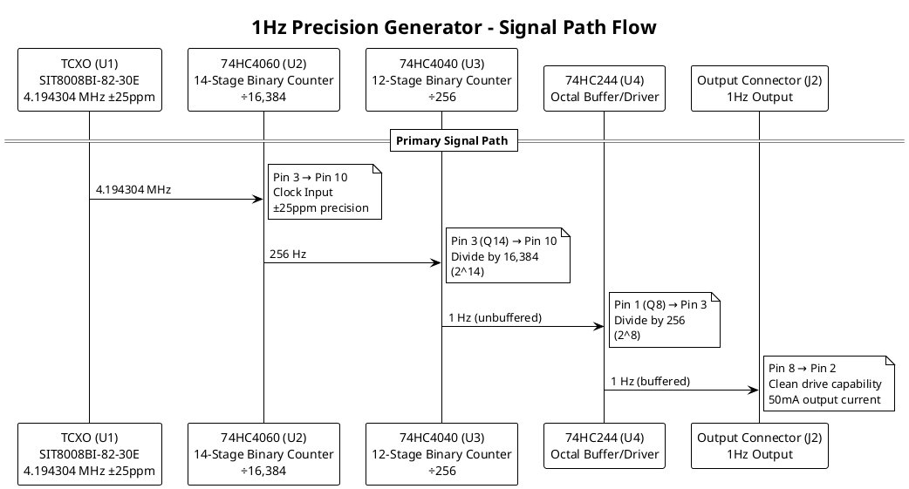

# 1Hz

|                 Stackup                 |                        Dimensions                         |                Drills                |
| :-------------------------------------: | :-------------------------------------------------------: | :----------------------------------: |
|  |  |  |

# Top

# Bottom

_flipped_

# Renders

|                          Top View                          |                        Bottom View                        |
| :--------------------------------------------------------: | :-------------------------------------------------------: |
|  |  |

# Top Assembly

|                              Top View                              |                      Render                       |
| :----------------------------------------------------------------: | :-----------------------------------------------: |
|  |  |

# Bottom Assembly

|                        Bottom View                        |                     Render                      |
| :-------------------------------------------------------: | :---------------------------------------------: |
|  |  |

# Test Points

The circuit includes four test points for verification and debugging:

| Test Point | Signal | Frequency | Purpose | Location |
|:------------:|:--------:|:-----------:|:---------:|:----------:|
| **TP1** | TCXO Output | 4.194304 MHz | Verify oscillator operation | U1 Pin 3 |
| **TP2** | First Division | 256 Hz | Verify 74HC4060 operation | U2 Pin 3 (Q14) |
| **TP3** | Final Division | 1 Hz (unbuffered) | Verify 74HC4040 operation | U3 Pin 1 (Q8) |
| **TP4** | Buffered Output | 1 Hz (buffered) | Verify 74HC244 operation | U4 Pin 8 |

# Bill of Materials

| Reference | Component | Value/Part Number | Package | Description | Estimated Cost |
|:-----------:|:-----------:|:-------------------:|:---------:|:-------------:|:----------------:|
| **U1** | TCXO | SIT8008BI-82-30E-4.194304 | SMD 5.0x3.2mm | 4.194304 MHz TCXO, ±25ppm, 3V | $15.00 |
| **U2** | Binary Counter | 74HC4060N | DIP-16 | 14-stage binary counter with oscillator | $1.50 |
| **U3** | Binary Counter | 74HC4040N | DIP-16 | 12-stage binary counter | $1.25 |
| **U4** | Buffer/Driver | 74HC244N | DIP-20 | Octal buffer/line driver | $1.75 |
| **C1** | Capacitor | 100nF | 0603 | TCXO decoupling capacitor | $0.05 |
| **C2** | Capacitor | 100nF | 0603 | 74HC4060 decoupling capacitor | $0.05 |
| **C3** | Capacitor | 100nF | 0603 | 74HC4040 decoupling capacitor | $0.05 |
| **C4** | Capacitor | 100nF | 0603 | 74HC244 decoupling capacitor | $0.05 |
| **C5** | Capacitor | 10µF | 0603 | 3V rail bulk filtering | $0.15 |
| **C6** | Capacitor | 10µF | 0603 | 5V rail bulk filtering | $0.15 |
| **R1** | Resistor | 10kΩ | 0603 | 74HC4060 reset pull-down | $0.02 |

# Mathematical Calculations

### TCXO → 74HC4060
$$
4,194,304"Hz" / 16,384 = 256 "Hz"
$$

### 74HC4060 → 74HC4040
$$
256"Hz" / 256 = 1 "Hz"
$$

### Output Accuracy
- TCXO ±25ppm

$$
±25"ppm" × 86,400 "seconds/day" = ±2.16 "seconds per day"
$$

# Signal Path

